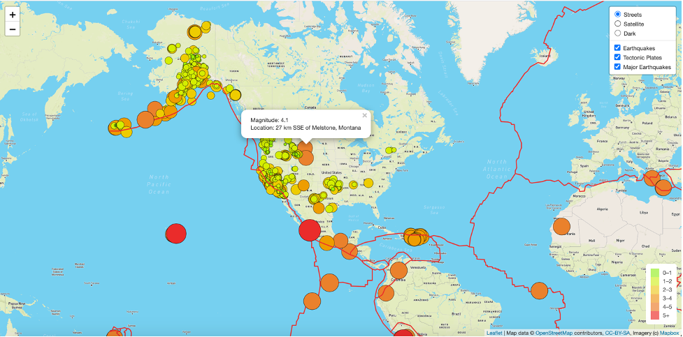
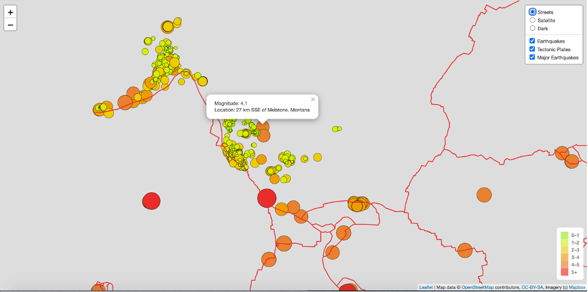

# Mapping_Earthquakes
Used JavaScript, HTML, CSS, Leaflet.js, geoJSON and Mapbox API to map earthquakes in relation to the tectonic plates’ location on the earth. Here's a screenshot of the result:  

Follow these steps to view the result on your browser:
1. Select the "Code" icon above. This is the icon that's colored green.  
2. Select "Download Zip" 
3. Open the zip 
4. Select the "Earthquake_Challenge" folder
5. Select the "indexChallenge.html" file. You should see this pop up on your browser: 

7. You will need to register for a Mapbox account and generate your API key to render the map visuals on the browser. Once you have your Mapbox API key, add the API key to the "config.js" file. Then, select the "indexChallenge.html" file, and you should see this pop up on your browser: 

